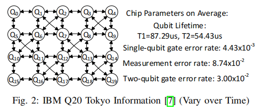
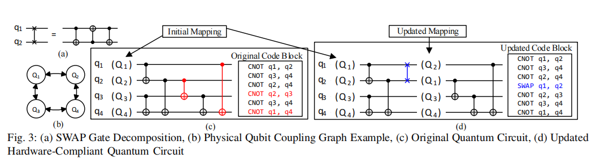
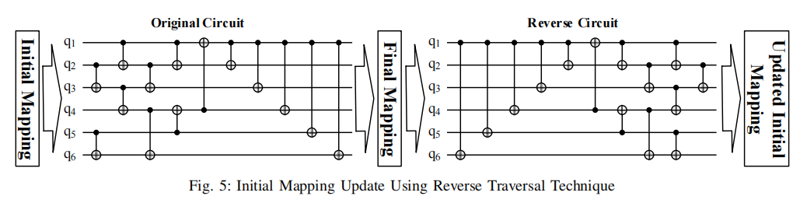
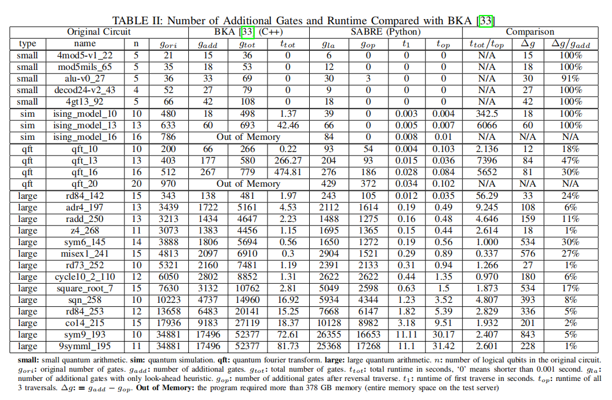
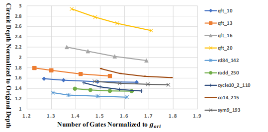

# 量子计算研讨课课程大作业论文报告

## SABRE: 面向 NISQ 设备的量子比特映射算法

| 项目 | 内容 |
|---|---|
| 论文 | *Tackling the Qubit Mapping Problem for NISQ-Era Quantum Devices* |
| 作者 | Gushu Li, Yufei Ding, Yuan Xie |
| 方向 | Qubit Mapping and Routing |
| 报告人 | 计42 张芝源，计42 陈家睦 |

## 摘要

NISQ 设备的物理比特连接通常是稀疏的，而量子线路模型往往默认任意两个逻辑比特都可以执行双比特门。二者之间的差异使 qubit mapping 成为量子编译中的关键问题：编译器必须选择 logical qubit 到 physical qubit 的映射，并在必要时插入 SWAP，使线路满足硬件耦合约束。本文分析 SABRE 算法的主要思想。SABRE 将全局 mapping 搜索转化为局部候选 SWAP 的启发式选择，并通过 front layer、extended set、reverse traversal 和 decay effect 分别处理当前门约束、有限前瞻、初始映射质量以及门数-深度折中。论文实验表明，SABRE 在 IBM Q20 Tokyo 拓扑上相较 BKA 具有更好的可扩展性，并在多类 benchmark 上保持较好的线路质量。

**关键词**: NISQ; qubit mapping; quantum compilation; SABRE; SWAP

## 1. 问题背景

真实 NISQ 芯片不是完全图。以 IBM Q20 Tokyo 为例，physical qubit 之间只存在有限耦合边，只有相邻物理比特才能直接执行对应的双比特门。若逻辑线路中的 `CNOT(q_i, q_j)` 被映射到两个不相邻的物理比特上，编译器必须插入 SWAP 改变映射关系。

<figure>
  
  <figcaption style="text-align:center;font-size:0.9em;">图 1 IBM Q20 Tokyo 的耦合图与平均硬件参数（论文 Fig. 2）。</figcaption>
</figure>

SWAP 并不是无成本操作。一个 SWAP 通常由多个基础双比特门实现，会增加总门数、线路深度和错误累积。由于 NISQ 设备缺乏完整量子纠错保护，mapping 质量会直接影响最终线路的执行可靠性。

## 2. 问题定义与难点

论文将 qubit mapping 定义为：给定输入量子线路和目标设备耦合图，寻找初始映射及中间 SWAP 序列，使所有双比特门均满足硬件连接约束，同时尽量减少额外门数和线路深度。

<figure>
  
  <figcaption style="text-align:center;font-size:0.9em;">图 2 通过插入 SWAP 将原始线路转换为硬件可执行线路（论文 Fig. 3）。</figcaption>
</figure>

该问题已被证明为 NP-Complete。其主要困难包括：第一，`n` 个 logical qubit 到 physical qubit 的排列空间随规模快速增长；第二，初始映射会影响后续所有 SWAP 选择；第三，额外门数和线路深度并非总能同时最小化。实际算法因此需要在可扩展性和线路质量之间折中。

## 3. SABRE 算法

SABRE 是 SWAP-based BidiREctional heuristic search 的缩写。算法不直接搜索完整 mapping 状态空间，而是在每一步选择一个较优候选 SWAP。

### 3.1 Front layer 与候选 SWAP

SABRE 用 DAG 表示双比特门依赖关系。front layer 是当前没有未执行前驱的双比特门集合。若 front layer 中的门已满足物理相邻约束，则直接执行；否则，算法只从相关 qubit 附近生成候选 SWAP，避免枚举全图所有交换。

### 3.2 启发式代价函数

对每个候选 SWAP，SABRE 临时更新映射并计算代价。最基础的 nearest-neighbor cost 只考虑 front layer 中门两端 physical qubit 的距离：

$$
H_{\text{basic}}=\sum_{gate\in F}D[\pi(gate.q_1)][\pi(gate.q_2)].
$$

其中 \(F\) 为 front layer，\(\pi\) 为当前 logical-to-physical mapping，\(D[i][j]\) 为物理耦合图上 \(Q_i\) 与 \(Q_j\) 的最短路距离。论文最终代价函数进一步引入未来门集合和 decay 惩罚，可写为：

$$
H_F=\frac{1}{|F|}\sum_{gate\in F}D[\pi(gate.q_1)][\pi(gate.q_2)]
$$

$$
H_E=\frac{1}{|E|}\sum_{gate\in E}D[\pi(gate.q_1)][\pi(gate.q_2)]
$$

$$
H=\max(decay(SWAP.q_1),decay(SWAP.q_2))\cdot(H_F+W H_E)
$$

这里 \(E\) 是 extended set，包含 front layer 后继的一小批门；\(W\) 是未来项权重，论文实验中取 \(W=0.5\)。候选 SWAP 的 \(H\) 越小，说明它越能缩短当前门和近未来门的物理距离。若某个 qubit 最近参与过 SWAP，则其 decay 值临时升高，相关候选交换会受到惩罚，从而减少连续重叠交换。

### 3.3 Reverse traversal

初始映射对最终 SWAP 数量影响很大。SABRE 先用临时映射正向遍历线路，得到最终映射；再反向遍历线路，利用正向最终映射反推出新的初始映射；最后用该映射再次正向生成结果。

<figure>
  
  <figcaption style="text-align:center;font-size:0.9em;">图 3 Reverse traversal 更新初始映射的过程（论文 Fig. 5）。</figcaption>
</figure>

Reverse traversal 的作用不是反向运行量子程序，而是在编译阶段利用线路依赖结构获得更具全局性的初始映射。

### 3.4 Decay effect

Decay effect 用于调节门数和深度。如果某个 qubit 最近参与过 SWAP，相关候选 SWAP 的代价会临时升高，算法更倾向选择不重叠交换。这有助于提高 SWAP 并行性，从而降低线路深度。

## 4. 实验结果

论文在 IBM Q20 Tokyo 20-qubit 拓扑上，将 SABRE 与 BKA 进行比较。主要实验结果见表 1。

<figure>
  
  <figcaption style="text-align:center;font-size:0.9em;">表 1 SABRE 与 BKA 在额外门数和运行时间上的比较（论文 Table II）。</figcaption>
</figure>

实验结果显示，小规模 benchmark 中 SABRE 可减少 91% 甚至全部额外门；在 large/qft benchmark 上，额外门数平均减少约 10%。可扩展性方面，BKA 在 ising16 和 qft20 上因内存超过 378GB 无法完成，而 SABRE 仍可在约 300MB 内存和约 0.1s 时间内完成。qft13 和 qft16 等实例中，论文报告了数千倍量级的运行时间优势。

<figure>
  
  <figcaption style="text-align:center;font-size:0.9em;">图 4 输出线路中门数与深度的折中关系（论文 Fig. 8）。</figcaption>
</figure>

图 4 表明，改变 decay 参数会影响输出线路在门数和深度之间的位置。这说明 SABRE 并非只优化单一指标，而是可以根据硬件条件调整优化倾向。

## 5. 贡献、局限与延伸思考

SABRE 的主要贡献在于将 qubit mapping 从指数级 mapping 状态搜索转化为局部 SWAP 搜索；通过 reverse traversal 改善初始映射；通过 decay effect 将深度控制纳入启发式代价函数。这些设计使其更适合 NISQ 规模下的实际编译任务。

同时，SABRE 仍是启发式算法，不能保证全局最优。其结果依赖 extended set 大小、权重 `W`、decay 参数和多次初始尝试。论文实验主要基于固定拓扑和既有 benchmark，未充分覆盖后续真实 NISQ 应用。此外，代价函数主要考虑拓扑距离、额外门数和深度，没有充分纳入不同 qubit 和不同耦合边的实时错误率差异。真实设备中，更少 SWAP 不一定等价于更高保真度；后续工作应进一步结合 noise-aware mapping、hardware-aware compilation 和 learning-based mapping。

## 6. 总结

SABRE 体现了量子编译在 NISQ 时代的重要性。量子线路能否在真实设备上可靠运行，不只取决于算法本身，也取决于编译器如何适配硬件拓扑和噪声条件。该论文的价值在于提出了一种可扩展、效果较好的 mapping 启发式框架，并为后续硬件感知量子编译器提供了重要基线。

## 参考文献

[1] Gushu Li, Yufei Ding, Yuan Xie. *Tackling the Qubit Mapping Problem for NISQ-Era Quantum Devices*. arXiv:1809.02573, 2018.  
[2] John Preskill. *Quantum Computing in the NISQ era and beyond*. Quantum 2, 79, 2018.
